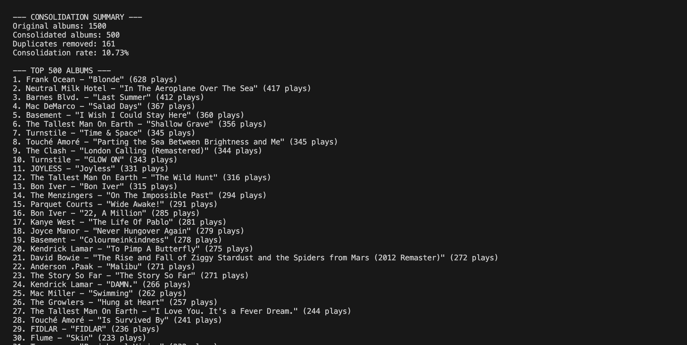

# Your Spotify Consolidator 🧹🔄📊

A scripting tool to fetch and consolidate Spotify top albums data from Your_Spotify API. This tool helps you collect your top 500 albums, by cleaning up duplicates and gives you a cleaned JSON document.

## Prerequisites

- Node.js 18.0.0 or higher
- npm or yarn package manager
- YourSpotify instance running (see [YourSpotify](https://github.com/Yooooomi/your_spotify))


## Installation

1. Clone the repository:
```bash
git clone <your-repo-url>
cd your-spotify-consolidator
```

2. Install dependencies:
```bash
npm install
```

3. Set up environment variables:
```bash
cp .env.example .env
```

4. Edit the `.env` file with your configuration:
```env
SPOTIFY_API_URL=your_api_url_here
SPOTIFY_COOKIE_TOKEN=your_jwt_token_here
START_DATE=2009-01-01T00:00:00.000Z
END_DATE=2025-12-12T00:00:00.000Z
BATCH_SIZE=20
TOTAL_CALLS=50
```

## Usage

### Fetch Data
To fetch your top albums data from the API:
```bash
npm run fetch
```

This will:
- Make multiple API calls with increasing offsets
- Save the raw data to a timestamped JSON file
- Display progress and summary statistics

### Clean and Consolidate Data
To clean and consolidate the fetched data:
```bash
npm run clean
```

This will:
- Find the latest JSON file in the directory
- Consolidate duplicate albums (same artist + album name)
- Remove redundant entries
- Save cleaned data to a new timestamped file
- Display consolidation statistics

## Example Output

### Fetch Progress
Watch the progress bar as it fetches the data:


### Consolidation Summary
After running the clean, you'll see a summary like this:



- **Original albums**: Total albums fetched from the API
- **Consolidated albums**: Final count of albums in the cleaned file
- **Duplicates removed**: Number of duplicate entries found and removed from the cleaned file
- **Consolidation rate**: Percentage of duplicates removed
- **Top 500 Albums**: Ranked list of your most-played albums

## Configuration

### Environment Variables

| Variable | Description | Default |
|----------|-------------|---------|
| `SPOTIFY_API_URL` | Base URL for the Spotify API | `https://{your_api_url}/spotify/top/albums` |
| `SPOTIFY_COOKIE_TOKEN` | JWT token for API authentication | Required |
| `START_DATE` | Start date for data collection | `2009-01-01T00:00:00.000Z` |
| `END_DATE` | End date for data collection | `2025-12-12T00:00:00.000Z` |
| `BATCH_SIZE` | Number of albums per API call | `20` |
| `TOTAL_CALLS` | Total number of API calls to make | `50` |

### Data Structure

The tool works with the following data structure:

```typescript
interface Album {
  duration_ms: number;
  count: number;
  albumId: string;
  album: {
    name: string;
    images: Array<{
      height: number;
      url: string;
      width: number;
    }>;
  };
  artist: {
    name: string;
    genres: string[];
  };
}
```

## Output Files

- `top-albums-{timestamp}.json`: Raw data from API calls
- `cleaned-top-albums-{timestamp}.json`: Consolidated and cleaned data

## Scripts

- `npm run fetch`: Fetch data from Your_Spotify API 
- `npm run clean`: Clean and consolidate existing data

## Troubleshooting

### Common Issues

1. **"SPOTIFY_COOKIE_TOKEN environment variable is required"**
   - Make sure you've created a `.env` file with your token
   - Verify the token is valid and not expired
   - You can get this from the network request when fetching data in your client application